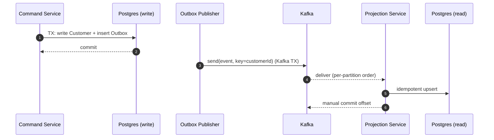

# gateway-customer-crud-kafka-cqrs

**Java 21 + Spring Boot 3.5.x · Kafka (KRaft) · PostgreSQL 16 · Flyway · CQRS + Outbox**

A minimal yet production‑style blueprint that demonstrates **CRUD → Outbox → Kafka events → Projection (read model)** with:

* **Command service** (write path): REST API, OLTP writes, and transactional **Outbox** publisher to Kafka
* **Projection service** (read path): consumes domain events, builds **read model** with idempotent versioned upserts
* **Kafka topics**: `customers.events.v1`, `customers.events.v1.retry`, `customers.events.v1.DLT`
* **Manual offset commits**, **retry + DLT**, **idempotency**, **topic compaction + retention**

---

## Table of contents

* [Architecture](#architecture)
* [Project structure](#project-structure)
* [Tech stack](#tech-stack)
* [Prerequisites](#prerequisites)
* [Quick start](#quick-start)
* [Configuration](#configuration)
* [Kafka topics & consumer groups](#kafka-topics--consumer-groups)
* [Database schemas](#database-schemas)
* [REST API (command service)](#rest-api-command-service)
* [Event envelope](#event-envelope)
* [Outbox publisher](#outbox-publisher)
* [Projection logic](#projection-logic)
* [Build & test](#build--test)
* [Troubleshooting](#troubleshooting)

---

## Architecture

```mermaid
graph TD
  A[Client (REST/GraphQL)] -->|CRUD Command| B[Command Service]
  B -->|TX write| C[(PostgreSQL\nwrite schema)]
  B -->|Outbox row same TX| D[(Outbox Table)]
  D -->|Publisher (Kafka TX)| E{{Kafka Cluster}}

  subgraph K[Kafka]
    direction TB
    T1[(customers.events.v1\ncompact,delete)]
    T2[(customers.events.v1.retry)]
    T3[(customers.events.v1.DLT)]
  end

  E --> T1

  T1 --> P1[Projection Service]\n
  P1 -->|idempotent upsert| R[(PostgreSQL\nread schema)]

  P1 -.->|poison| T3
```

**Delivery semantics**: at‑least‑once consumer with idempotent writes; producer can be configured for exactly‑once (transactional id + read_committed consumers).

---

## Project structure

```
gateway-customer-crud-kafka-cqrs/
├─ settings.gradle
├─ build.gradle
├─ .env
├─ docker/
│  └─ docker-compose.yml           # Kafka (KRaft) + PostgreSQL infra only
├─ common-events/
│  └─ src/main/java/com/github/dimitryivaniuta/gateway/common/event/
│     ├─ CustomerEventEnvelope.java
│     ├─ CustomerCreated.java
│     ├─ CustomerUpdated.java
│     ├─ CustomerDeleted.java
│     └─ CustomerTopics.java
├─ command-service/
│  ├─ src/main/java/com/github/dimitryivaniuta/gateway/command/
│  │  ├─ CommandApplication.java
│  │  ├─ customer/domain/Customer.java
│  │  ├─ customer/domain/Outbox.java
│  │  ├─ customer/repo/CustomerRepository*.java
│  │  ├─ customer/repo/OutboxRepository*.java
│  │  ├─ customer/service/CustomerService.java
│  │  ├─ outbox/OutboxPublisher.java
│  │  └─ kafka/CustomerTopicsConfig.java
│  └─ src/main/resources/
│     ├─ application.yml
│     └─ db/migration/
│        ├─ V1__init_write_schema.sql
│        └─ V2__indexes.sql (optional)
├─ projection-service/
│  ├─ src/main/java/com/github/dimitryivaniuta/gateway/projection/
│  │  ├─ ProjectionApplication.java
│  │  ├─ kafka/CustomerProjectionListener.java
│  │  ├─ kafka/CustomerErrorHandlingConfig.java
│  │  └─ repo/{CustomerView.java, CustomerViewRepository.java}
│  └─ src/main/resources/
│     ├─ application.yml
│     └─ db/migration/V1__init_read_schema.sql
└─ README.md
```

---

## Tech stack

* **Language/Runtime**: Java 21
* **Framework**: Spring Boot 3.5.x (native Gradle BOM via `platform`)
* **Messaging**: Apache Kafka (KRaft single‑node for local)
* **Database**: PostgreSQL 16, Flyway migrations
* **Build**: Gradle, Lombok

---

## Prerequisites

* Docker Engine + Docker Compose
* JDK 21
* `curl` or Postman for API checks

---

## Quick start

1. **Start infra** (Kafka + Postgres):

```bash
cd docker
docker compose up -d
```

> If Kafka fails with `CLUSTER_ID is required`, use the provided compose that sets `KAFKA_CLUSTER_ID`.

2. **Provide env** (root `.env` already contains all keys referenced by the apps):

```env
POSTGRES_HOST=localhost
POSTGRES_PORT=5432
POSTGRES_DB=appdb
POSTGRES_USER=app_user
POSTGRES_PASSWORD=app_pass
KAFKA_BOOTSTRAP_SERVERS=localhost:9092
COMMAND_SERVICE_PORT=8081
PROJECTION_SERVICE_PORT=8082
KAFKA_CONSUMER_GROUP=customer-projection
```

3. **Run services** (two terminals):

```bash
./gradlew :command-service:bootRun
./gradlew :projection-service:bootRun
```

4. **Create a customer**

```bash
curl -s -X POST http://localhost:8081/api/customers \
  -H 'Content-Type: application/json' \
  -d '{"name":"Alice","email":"alice@example.com"}'
```

5. **Verify projection** — check `read.customers_view` in Postgres (after the event is consumed).

---

## Configuration

Both services load the root `.env` first:

```yaml
spring:
  config:
    import:
      - "optional:file:.env[.properties]"
```

Key settings:

* **command-service**: Kafka **producer** (idempotent + `transactional-id`), JPA schema `write`, Flyway `write`
* **projection-service**: Kafka **consumer** (`enable-auto-commit=false`, `ack-mode=MANUAL`, `auto-offset-reset=earliest`, `isolation-level=read_committed`), JPA schema `read`, Flyway `read`

---

## Kafka topics & consumer groups

* **Topics**

    * `customers.events.v1` — domain events (Create/Update/Delete). `cleanup.policy=compact,delete` + time retention.
    * `customers.events.v1.retry` — optional retry stream (not mandatory for the basic flow).
    * `customers.events.v1.DLT` — poison messages.
* **Groups**

    * `customer-projection` — projection service
    * Add more groups for search, cache, audit, etc. (each group replays the topic independently).

**Partitioning**: start with `12` partitions in prod (3 in dev). Key = `customerId` to preserve per‑aggregate ordering.

---

## Database schemas

* **Write schema (`write`)**

    * `customers(id uuid pk, name, email unique, version bigint, created_at, updated_at)`
    * `outbox(id bigserial pk, aggregate_type, aggregate_id, event_type, version, payload jsonb, occurred_at, published, event_id uuid unique)`
* **Read schema (`read`)**

    * `customers_view(id uuid pk, name, email unique, version bigint)`

Migrations live under each service’s `db/migration/` and are applied by Flyway on startup.

---

## REST API (command service)

Minimal example (create):

```
POST /api/customers
Content-Type: application/json
{
  "name": "Alice",
  "email": "alice@example.com"
}
→ 201 Created { "id": "<uuid>" }
```

On success: OLTP row + Outbox row are written in the **same transaction**.

---

## Event envelope

```json
{
  "eventId": "uuid",
  "aggregateId": "uuid",
  "eventType": "CustomerCreated | CustomerUpdated | CustomerDeleted",
  "version": 3,
  "timestampUtcMillis": 1731066300000,
  "actor": "command-service",
  "payload": { "name": "Alice", "email": "alice@example.com" }
}
```

---

## Outbox publisher

* Periodic task locks a batch via `FOR UPDATE SKIP LOCKED` → sends to Kafka using **`kafkaTemplate.executeInTransaction(...)`** → marks rows `published=true` **only after** successful send.
* Multiple publisher instances can run without duplicate work.

---

## Projection logic

* `CustomerProjectionListener` consumes from `customers.events.v1` with manual acks.
* `CustomerViewRepository.applyEvent(...)` performs **idempotent, version‑checked** upserts/deletes into `read.customers_view`.

**Sequence**



---

## Build & test

```bash
# Run static checks & tests
./gradlew clean build

# Run each service
./gradlew :command-service:bootRun
./gradlew :projection-service:bootRun
```

---

## Troubleshooting

* **Kafka fails with `CLUSTER_ID is required`**: use the provided compose with `KAFKA_CLUSTER_ID` set; if you changed it, wipe the Kafka volume.
* **`No security protocol defined for listener PLAINTEXT_HOST`**: either remove the extra listener or define `KAFKA_LISTENER_SECURITY_PROTOCOL_MAP` appropriately.
* **Deserializer conflict**: configure JSON **either** entirely via properties **or** via beans, not both.
* **Consumer missed old events**: ensure topic retention covers downtime; for a *new* group, set `auto-offset-reset=earliest`; to reprocess, run `kafka-consumer-groups --reset-offsets`.
* **Outbox rows not clearing**: ensure the publisher marks `published=true` **inside the same transaction** that executes the Kafka transaction.

---

## License

This project is licensed under the [MIT License](LICENSE).

---

## Contact

**Dimitry Ivaniuta** — [dzmitry.ivaniuta.services@gmail.com](mailto:dzmitry.ivaniuta.services@gmail.com) — [GitHub](https://github.com/DimitryIvaniuta)
